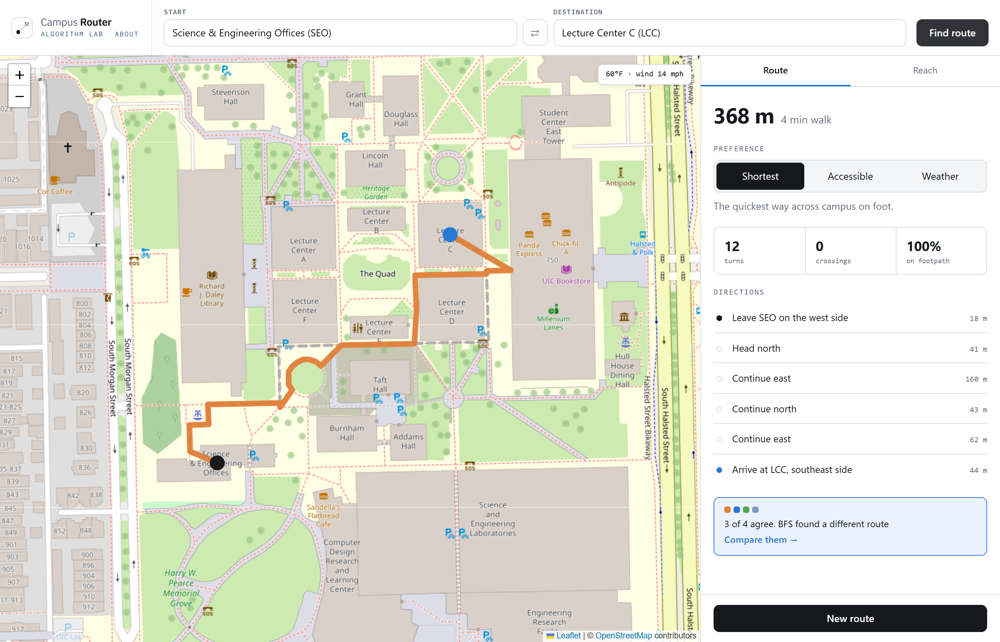
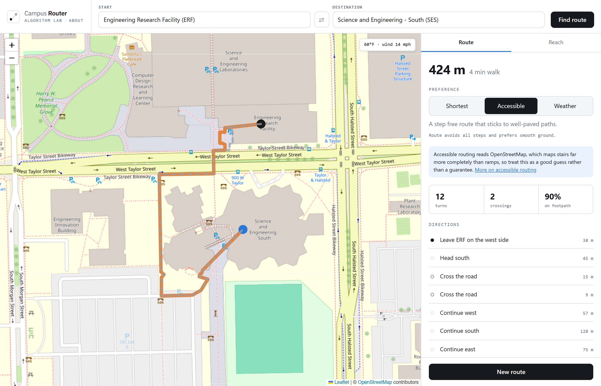
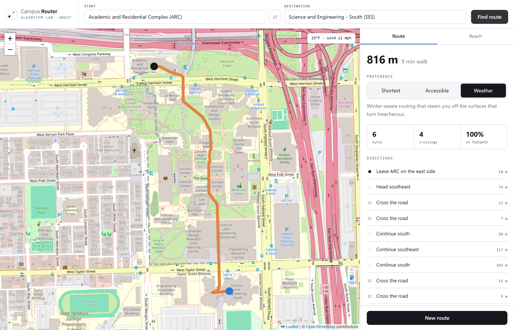
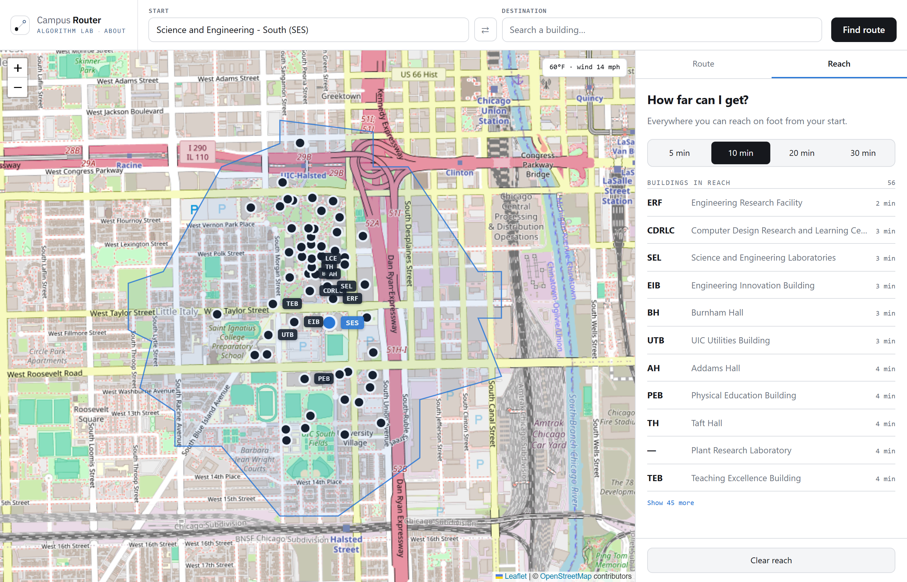
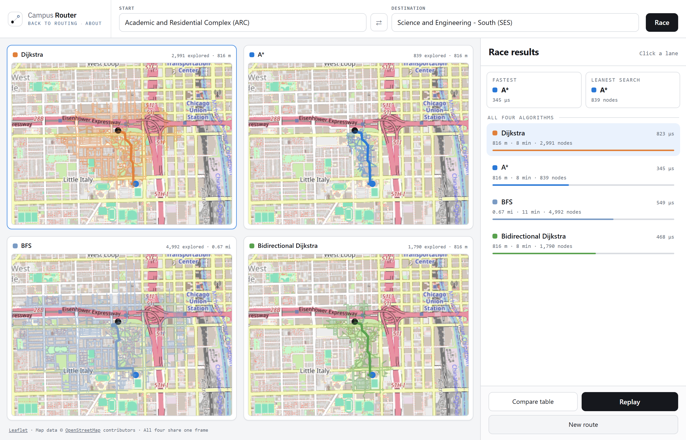
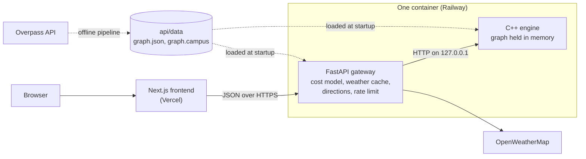

# Campus Router

<!-- LIVE LINK TODO: replace "coming soon" with the Vercel URL once the app is deployed. -->
**Live demo:** coming soon &nbsp;·&nbsp; Code: [MIT](LICENSE) &nbsp;·&nbsp; Map data: [ODbL](LICENSE-DATA)

Campus Router is a walking map for the University of Illinois Chicago. Pick two buildings and it shows you the quickest way to walk between them, along with how long it takes and directions to follow. Two additional modes adapt the route to the person and the season: Accessible avoids every staircase on the map, for anyone using a wheelchair or otherwise unable to take stairs, and Weather adjusts for snow and ice based on current conditions. A separate Reach view outlines the area you can cover on foot within 5 to 30 minutes.

Alongside the routing tool is a lab for comparing pathfinding algorithms. It runs Dijkstra, A\*, BFS and bidirectional Dijkstra on the same trip, then replays each search on its own map with its measured runtime.



## Features

### Accessible



<br>

Routes around every staircase and penalizes rough ground such as gravel and cobbles. About one building pair in ten ends up with a longer walk.

<br>
OpenStreetMap maps stairs much better than ramps. A missing step free route can simply mean a missing path, so check anything important with the university.

<br clear="all">

### Weather

Factors in snow and ice that slow walking down. The figures come from a research paper by Fossum and Ryeng (2021), who timed pedestrians walking on winter pavement. The paper found no measurable effect from rain, so the mode accounts for snow and ice rather than bad weather in general.



| Surface | Walking time |
|---|---|
| Bare pavement | Baseline, 1.607 m/s |
| Compact snow | 7% longer |
| Loose snow | 9% longer |
| Gritted ice | 10% longer |
| Clean ice | 19% longer |

On a snowy reading the 816 m walk from ARC to SES is timed at nine minutes instead of eight.

<br clear="all">

### Reach



<br>

Shades everywhere you can walk to from a building within 5, 10, 20 or 30 minutes.
The outline follows real footpaths instead of drawing a circle.

<br>
It uses the same algorithm that the routing modes use, but stops at the chosen walking time instead of at a destination.

<br>
Near the edge of the mapped area the shape stops where the data stops, not where your walking time runs out.

<br clear="all">

### The lab

Shows how differently four pathfinding algorithms search for the same route. You can watch all four side by side and replay any of them.

Here is how the four compare on the walk from ARC to SES:

| Algorithm | What it finds | How much of the map it explored |
|---|---|---|
| Dijkstra | the shortest route, spreading out evenly | 2,991 nodes |
| A\* | the shortest route, aiming at the destination | 839 nodes |
| BFS | the route with the fewest segments, regardless of length | 4,992 nodes |
| Bidirectional Dijkstra | the shortest route, searching from both ends | 1,790 nodes |

Three of them agree on an 816 m walk. BFS finds one 258 m longer, because it counts path segments rather than distance.



On a longer trip across both campuses, BFS explores more of the map than Dijkstra, 13,316 nodes against 12,898, and still finishes about three times faster, because a plain queue costs less per node than a priority queue.

## Tech stack

| Layer | Built with |
|---|---|
| Engine | C++20, compiled with g++ through a plain Makefile |
| Gateway | Python, FastAPI, httpx |
| Frontend | TypeScript, Next.js, React, React Query, Leaflet |
| Map data | OpenStreetMap, pulled through the Overpass API and processed offline in Python |
| Weather | OpenWeatherMap |
| Testing | A hand written C++ test harness, pytest, Vitest, Playwright, GitHub Actions |
| Hosting | Vercel for the frontend and a single Railway container for the backend, not yet deployed |

## Architecture



### The map

Python scripts download both campuses from OpenStreetMap ahead of time, split every path into short edges that keep their own tags, and connect each building to the network through its mapped entrances where there are any. The result is 16,149 nodes, 19,392 edges and 113 buildings, from data downloaded on 2026-09-06. It is written twice: `graph.json` for the gateway, which needs the tags to build directions, and `graph.campus`, a compact text format the engine loads. Nothing calls OpenStreetMap for routing data while the site is running.

### The request

A request goes first to the gateway, a Python service. It looks up the two buildings, reads the weather if the mode needs it, turns the mode into a cost table, and passes all of that to the engine. The engine returns the path, and the gateway converts it into the directions on screen.

### The engine

It has its own JSON parser and HTTP server, and uses nothing beyond the C++ standard library and the operating system's sockets. The map never changes once loaded, so it sits in one flat array with an offset per node, and a route across both campuses takes about 2 ms.

### The container

The gateway starts the engine, restarts it if it crashes, and counts it in its own health check, so a dead engine cannot hide behind a working gateway. The engine listens only inside the container, so nothing outside can reach it.

## Validation

### Against another router

Routes for 40 pairs of buildings are compared against OSRM's foot profile, an independent router. It reads the same OpenStreetMap data, so this cannot catch an error in the map. What it checks is the part that is ours: the pipeline, the graph it builds and the routing on top of it. The median ratio between the two is 1.008, and 31 of the 40 pairs agree within 5%.

### Against the ground

The map itself can only be checked on the ground, and it was, in two places. The underpass beneath Science and Engineering South has no ramp and no lift, which confirms the long detours around it, and Student Center East Tower turned out to have a step free entrance that no path in the map connected to, so the missing 15.8 m was added.

### Tests

Each part has its own tests, and CI runs all of them, along with checks against a live backend, on every push to `main` and every pull request. The gap is the interface, where the React components have no unit tests and are covered only by a browser check that clicks through the real site.

Both A\* and bidirectional Dijkstra are easy to get subtly wrong. A\*'s estimate never exceeds the real remaining cost, because no surface costs less than its own length. Scaling that straight line estimate by the cheapest multiplier in play makes it as tight as this scaling allows, without breaking that guarantee. Bidirectional Dijkstra cannot stop the moment its two searches meet, because the first node they share is not always on the best path. Either mistake still produces a believable route, so a property test runs all three shortest route searches on 200 randomly generated maps and fails if their costs ever disagree.

## Running locally

You'll need Python 3.12 or newer, Node.js 22 or newer, and a C++20 compiler, plus `make` on macOS or Linux. A weather key is optional; without one, weather mode routes by distance and says so.

On Windows, this builds the engine and starts the backend:

```powershell
powershell -ExecutionPolicy Bypass -File scripts/dev.ps1
```

On macOS or Linux:

```bash
make -C engine
python3 -m venv .venv
source .venv/bin/activate
pip install -r api/requirements-dev.txt
python -m uvicorn api.main:app --port 8000 --reload
```

Then start the frontend in a second terminal and open http://localhost:3000:

```bash
cd web
npm install
npm run dev
```

To turn on weather mode, copy `api/.env.example` to `api/.env` and add an `OPENWEATHER_API_KEY`. To run the tests:

```bash
make -C engine test
python -m pytest api/tests pipeline/tests -q
cd web && npm run typecheck && npm test
```

To rebuild the map from a fresh OpenStreetMap download:

```bash
python -m pipeline.extract --refresh
python -m pipeline.transform
python -m pipeline.validate
```

## Project structure

```
.
├── engine/                 # C++ routing engine, no dependencies
│   ├── include/campus/     #   Headers: graph, algorithms, cost model, JSON, service
│   ├── src/                #   Graph storage, four algorithms, JSON parser, HTTP server
│   ├── cli/                #   Offline harness for routing by hand
│   ├── tests/              #   Hand written test harness and suites
│   └── Makefile
├── api/                    # FastAPI gateway, owns the engine process
│   ├── core/               #   Settings, read from api/.env
│   ├── routes/             #   The public endpoints
│   ├── services/           #   Cost model, weather cache, directions, engine client
│   ├── data/               #   graph.json for the gateway, graph.campus for the engine
│   └── tests/
├── pipeline/               # Offline map build, never runs at request time
│   ├── extract.py          #   Pulls both campuses from Overpass
│   ├── transform.py        #   Splits ways into tagged edges, links buildings
│   ├── validate.py         #   Checks the result before it ships
│   └── patches.json        #   The one hand verified map fix
├── web/                    # Next.js site
│   ├── app/                #   Navigate, the lab, the about page
│   ├── components/         #   Map panes, canvas renderer, panels
│   ├── lib/                #   URL state, formatting, geometry, the logic the tests cover
│   └── scripts/            #   Browser checks and screenshot capture
└── scripts/                # Dev server, smoke checks, OSRM comparison, step free sweep
```

The first four each have their own README with more detail: [engine](engine/README.md), [gateway](api/README.md), [pipeline](pipeline/README.md), [web](web/README.md).

## Credits and license

- The map is built from [OpenStreetMap](https://www.openstreetmap.org/). Map data © OpenStreetMap contributors, under the [ODbL](https://opendatacommons.org/licenses/odbl/1-0/). The files in `api/data/` are built from it and carry the same license. See [LICENSE-DATA](LICENSE-DATA).
- Map tiles come from the OpenStreetMap Foundation, under their [tile usage policy](https://operations.osmfoundation.org/policies/tiles/). Weather comes from [OpenWeather](https://openweathermap.org/).
- Winter walking speeds are from Fossum and Ryeng (2021), [The walking speed of pedestrians on various pavement surface conditions during winter](https://doi.org/10.1016/j.trd.2021.102934), *Transportation Research Part D*.
- Built with Leaflet (BSD 2-Clause), react-leaflet (Hippocratic 2.1), and IBM Plex (SIL Open Font License 1.1). The other runtime dependencies are MIT, and the build and test tools add Apache 2.0, including TypeScript and Playwright.
- The code is under the [MIT License](LICENSE).

Campus Router is a personal project and isn't affiliated with or endorsed by the University of Illinois Chicago. There are no accounts, no analytics and no cookies, and apart from the site's own backend the only requests your browser makes are for the map tiles.
